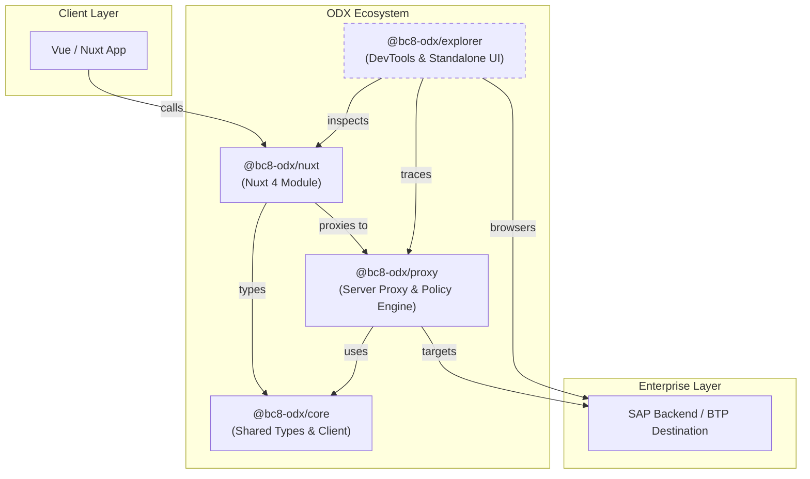

Integrating SAP OData into modern TypeScript applications is often filled with friction — magic strings, manual auth handling, and untyped payloads. **ODX (OData Developer Experience)** transforms this into a type-safe, modular, and visually intuitive workflow.

## What is ODX?

ODX is a comprehensive toolkit designed to bridge the gap between enterprise OData services and modern web frameworks like Nuxt 4. It handles the heavy lifting of authentication, type generation, and request proxying, allowing you to focus on building your application.

## How the Packages Fit Together

ODX is a **pnpm workspace monorepo** composed of four focused packages. Each package has a single responsibility, and they compose together seamlessly:

:::card-group
  ::card
  ---
  title: Nuxt Module
  icon: i-simple-icons-nuxtdotjs
  to: /nuxt/getting-started
  ---
  Nuxt 4 module with auto-imports, DevTools, and zero-config setup. Ideal for building Nuxt applications.
  ::

  ::card
  ---
  title: Proxy
  icon: i-lucide-server
  to: /proxy/installation
  ---
  Standalone Nitro/H3 proxy for BTP auth, CSRF, and routing. Perfect for BFF layers or non-Nuxt frameworks.
  ::

  ::card
  ---
  title: Core SDK
  icon: i-lucide-code-2
  to: /core/installation
  ---
  Framework-agnostic TypeScript SDK and OData types. The base client without any framework binding.
  ::

  ::card
  ---
  title: Explorer
  icon: i-lucide-monitor
  to: /explorer/setup
  ---
  Visual tool for schema exploration and traffic monitoring. Available as integrated DevTools or as a standalone productive service catalog.
  ::
:::

## The Request Lifecycle

A typical proxied request flows through the following stages:

1. **Composable call** — Your Vue component calls `useOData().MyService.Products.list()`.
2. **Nuxt module** — `@bc8-odx/nuxt` translates the dot-notation call into a typed fetch request to the internal proxy route (e.g. `/api/odx/MyService/Products`).
3. **Proxy handler** — `@bc8-odx/proxy` receives the request, applies security policies, fetches a CSRF token if needed, and forwards the call to the SAP backend.
4. **SAP Backend** — The backend processes the OData request and returns the response.
5. **Core types** — `@bc8-odx/core` provides the shared `ODataQuery` and response types used across all packages.

## Core Philosophies

- **Type Safety First**: Automated model generation from your actual SAP schema (EDMX).
- **Agnostic Heart**: Core logic works in any TypeScript environment, not just Nuxt.
- **Enterprise Ready**: First-class support for SAP BTP, Principal Propagation, and Connectivity Service.
- **Offline Capable**: Mock any OData backend with local JSON files for rapid UI development.

## Next Steps

The fastest path is the Nuxt module. Follow the [Getting Started guide](/nuxt/getting-started) to set up ODX in a Nuxt 4 project in minutes.

:u-button{to="/nuxt/getting-started" label="Get started with the Nuxt Module" trailing-icon="i-lucide-arrow-right" size="lg"}
