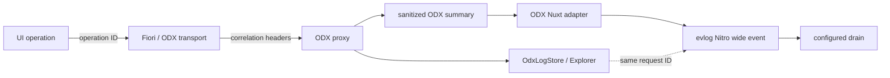

# evlog observability evaluation

Status: proposed pilot
Evaluated version: `evlog@2.22.3`
Evaluation date: 2026-07-24

## Decision

Adopt evlog as an **optional Nuxt/Nitro host observability adapter**, starting with a bounded ODX proxy pilot. Do not add evlog to ODX core, metadata, framework-neutral Fiori packages, or renderer packages.

evlog and `OdxLogStore` solve different problems:

- evlog produces one operational wide event per HTTP request and drains it to observability backends;
- `OdxLogStore` retains OData request history and step-level proxy traces for the ODX Explorer.

Connect both through shared, privacy-safe correlation fields. Do not copy OData payloads or unrestricted trace details into evlog. No production dependency should be added until the pilot meets the gates below.

## Why evaluate evlog

The stack crosses a browser interaction, a Fiori controller and renderer, ODX transport, Nuxt/Nitro proxy, destination/auth/policy processing, and an OData backend. Individual console messages are weak evidence across that path.

evlog's wide-event model is useful at the Nitro boundary: it gathers request facts into one structured event and supports multiple external drains. Its Nitro integration emits after the response or on error and uses runtime `waitUntil` where available. This does not provide end-to-end tracing by itself; browser-to-backend correlation remains an owned ecosystem contract.

## Evidence and constraints

The evaluation used the published package, declarations, and runtime output plus these primary sources:

- [evlog documentation](https://www.evlog.dev/)
- [evlog repository](https://github.com/hugorcd/evlog)
- [Nuxt module entry](https://nuxt.com/modules/evlog)
- [npm package](https://www.npmjs.com/package/evlog)

At evaluation time:

- Node 18 or newer is required and Nuxt Kit/Nitro peers fit the ecosystem versions;
- server integrations, browser logging, drains, structured errors, redaction, sampling, and audit helpers are included;
- the package is about 442 KB compressed and 1.6 MB unpacked; subpath exports limit what a bundler selects;
- the Nuxt module registers server and client plugins; client-to-server transport is optional;
- the client ingest endpoint validates origin and bounds input, but is not an authenticated audit channel and can be spoofed by non-browser clients;
- `log.fork()` is not supported by the Nitro/Nuxt integration, so evlog cannot automatically correlate child events below a Nitro request;
- releases are frequent; the pilot must pin an exact version and gate upgrades.

## Fit by layer

| Layer | Fit | Decision |
| --- | --- | --- |
| `@me-tools/odx-metadata` | Poor | Keep deterministic parsing free of runtime logging. Expose diagnostics as data. |
| `@me-tools/odx-core` | Poor | Keep transports and `OdxLogStore` framework-neutral. |
| `@me-tools/odx-proxy` | Good | Produce a sanitized operation summary; do not import evlog. |
| `@me-tools/odx-nuxt` | Very good | Own the optional Nitro-request adapter. |
| ODX Explorer | Complementary | Keep detailed request history and proxy steps; link by correlation ID. |
| `@me-tools/fiori-core` | Poor | Report lifecycle events through an owned optional port. |
| `@me-tools/fiori-odx` | Possible later | Propagate operation/request identifiers without depending on evlog. |
| Vue/Nuxt Fiori UI | Limited | Emit semantic lifecycle telemetry, never business values. |
| Nuxt application host | Very good | Own evlog, drains, sampling, privacy, and deployment configuration. |

## Proposed architecture



The application creates or accepts an operation ID. ODX propagates it and a request ID through approved headers. The proxy owns OData phase timing and outcomes. `@me-tools/odx-nuxt` maps the allowlisted summary into the current Nitro logger. evlog owns request assembly, sampling, formatting, and drains.

The adapter must use explicit request context. It must not assume AsyncLocalStorage can correlate child work in Nuxt while `log.fork()` is unsupported there.

## Event contract

Start with a small versioned `odx` namespace:

```ts
interface OdxOperationalEvent {
  schemaVersion: 1
  operationId?: string
  requestId: string
  parentRequestId?: string
  serviceId: string
  entitySetId?: string
  operation: 'metadata' | 'read' | 'create' | 'update' | 'delete' | 'action'
  proxyMode: 'direct' | 'buffer' | 'stream'
  targetKind: 'url' | 'destination' | 'mock'
  status: number
  outcome: 'success' | 'failure' | 'cancelled'
  durationMs: number
  backendDurationMs?: number
  policyDurationMs?: number
  retryCount?: number
  errorCode?: string
  errorTarget?: string
  retriable?: boolean
}
```

Identifiers refer to configuration and metadata, not business values. Forbidden by default:

- authorization, cookies, CSRF, credentials, and session identifiers;
- request/response bodies, entity keys, unrestricted URLs, filter/search literals;
- raw backend errors, raw metadata, field/form values, selected row data;
- raw `proxyTrace.details`.

Stable domain errors remain owned by ODX/Fiori. The host may project their code, target, and retryability into evlog; evlog types must not leak into public domain contracts.

## Security posture

1. Build an allowlisted event rather than copying request context.
2. Apply ODX protections before storage or export.
3. Enable evlog redaction as defence in depth.
4. Keep client transport disabled by default.
5. Never treat client ingest as an audit/security signal.
6. Disable development stream tooling in production.
7. Review every field for sensitivity and cardinality.

Production OData payload logging remains disabled. evlog does not change the policy in `SECURITY.md`.

## Pilot

Pilot in a Nuxt fixture/playground and the ODX proxy integration:

- install an exact evlog version at application level;
- enable its Nuxt module with client transport disabled;
- add a host adapter for proxy routes;
- enrich the request event with one sanitized ODX summary;
- link its `OdxLogStore` record by request ID;
- first use a test drain, then one vendor drain outside production.

Do not instrument every Fiori controller/component during this pilot.

### Acceptance gates

- disabled mode changes neither behavior nor OData request shape;
- Node server and at least one edge preset pass build/runtime smoke tests;
- static deployments remain supported by omitting server observability;
- no client logger transport or ingest route is enabled implicitly;
- tests prove forbidden data never reaches a drain;
- Explorer and the wide event share the same request ID;
- success, backend failure, policy rejection, cancellation, and streaming completion each produce one consistent summary;
- p95 proxy overhead stays below 1 ms or 3%, whichever is larger;
- application asset and request budgets remain green;
- drain failure cannot fail or delay the OData response;
- dependency version and license pass repository checks.

### Exit criteria

Promote the adapter to `@me-tools/odx-nuxt` only if it remains small and optional. Otherwise publish a separate `@me-tools/odx-observability-evlog` adapter. Abandon it if evlog types enter portable contracts, it duplicates Explorer payload history, or it misses deployment/overhead gates.

## Future cross-layer telemetry

The Fiori architecture already anticipates a `TelemetryPort`. Define it from concrete questions: which semantic operation failed, which ODX request fulfilled it, which capability chose a rendering path, and how long compilation/controller/transport/backend work took.

These events should share the operation ID but remain independent of evlog. Nuxt can aggregate selected measurements into a request event; other hosts can use OpenTelemetry, browser performance APIs, or another logger.

## Recommended next action

Implement correlation and the sanitized proxy-summary contract first, with a no-op default and tests. Then add the evlog application pilot. The durable contract remains useful if evlog changes or is replaced.
