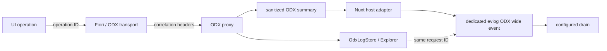

# evlog observability evaluation

Status: neutral ODX foundation and bounded host pilot implemented
Evaluated version: `evlog@2.22.4`
Evaluation date: 2026-07-30

## Decision

Adopt evlog as an **optional Nuxt/Nitro host observability adapter**, starting with a bounded ODX proxy pilot. Do not add evlog to ODX core, metadata, framework-neutral Fiori packages, or renderer packages.

evlog and `OdxLogStore` solve different problems:

- evlog produces one operational wide event per HTTP request and drains it to observability backends;
- `OdxLogStore` retains OData request history and step-level proxy traces for the ODX Explorer.

Connect both through shared, privacy-safe correlation fields. Do not copy OData payloads or unrestricted trace details into evlog. No production dependency should be added until the pilot meets the gates below.
The completed pilot keeps evlog as a root development dependency only. It does
not add evlog to any published ODX package.

## Why evaluate evlog

The stack crosses a browser interaction, a Fiori controller and renderer, ODX transport, Nuxt/Nitro proxy, destination/auth/policy processing, and an OData backend. Individual console messages are weak evidence across that path.

evlog's wide-event model is useful at the Nitro boundary: it gathers request facts into one structured event and supports multiple external drains. Its Nitro integration emits after the response or on error and uses runtime `waitUntil` where available. This does not provide end-to-end tracing by itself; browser-to-backend correlation remains an owned ecosystem contract.

## Evidence and constraints

The evaluation used the published package, declarations, and runtime output plus these primary sources:

- [evlog documentation](https://www.evlog.dev/)
- [evlog repository](https://github.com/hugorcd/evlog)
- [Nuxt module entry](https://nuxt.com/modules/evlog)
- [npm package](https://www.npmjs.com/package/evlog)

At evaluation time:

- Node 18 or newer is required and Nuxt Kit/Nitro peers fit the ecosystem versions;
- server integrations, browser logging, drains, structured errors, redaction, sampling, and audit helpers are included;
- the package is about 442 KB compressed and 1.6 MB unpacked; subpath exports limit what a bundler selects;
- the Nuxt module registers server and client plugins; client-to-server transport is optional;
- the client ingest endpoint validates origin and bounds input, but is not an authenticated audit channel and can be spoofed by non-browser clients;
- `log.fork()` is not supported by the Nitro/Nuxt integration, so evlog cannot automatically correlate child events below a Nitro request;
- releases are frequent; the pilot must pin an exact version and gate upgrades.

The 2026-07-30 re-evaluation also covered `@evlog/cli@0.3.0`. The CLI can map
Nuxt 4 entry points and compare observability coverage against a baseline. That
is potentially useful as a repository diagnostic, but it measures logging
instrumentation rather than ODX/Fiori feature correctness. It must therefore
remain a separate non-gating experiment until its output is deterministic,
privacy-safe, and demonstrably adds signal beyond the existing compatibility
ledger and runtime evidence.
The executable CLI experiment confirmed that it is not ready for this stack:

- `map --all --json --no-write` scored the instrumented ODX Nuxt fixture at 38,
  reported zero instrumented routes, and marked all three discovered routes
  dark. Static route inspection did not recognize the dedicated Nitro plugin
  that the E2E test proves emits one correlated wide event, and it counted two
  test-only memory-drain routes as production entry points.
- A separate Nuxt Fiori playground run was stopped by pnpm's high-risk trust
  downgrade protection for the transitive
  `@oxc-parser/binding-darwin-x64@0.82.3` package because the selected artifact
  had weaker provenance evidence than an earlier release. The repository must
  not bypass that supply-chain check merely to obtain a diagnostic score.

Consequently, neither `--minScore` nor `--baseline` belongs in CI yet. Revisit
only after plugin/hook instrumentation and route exclusions are represented
accurately and the transitive provenance regression is resolved upstream.

The executable pilot also found two integration constraints that are not
obvious from the high-level documentation:

- `evlog/nitro` sets `nitro.options.noExternals = true` globally. This caused
  the ODX Nuxt fixture build to pull unrelated application dependencies into
  the server bundle and fail on the SAP mock-server toolchain;
- the normal Nuxt/Nitro request event is sealed before an ODX streamed response
  publishes its completion summary. Enriching that event from
  `odx:proxy:telemetry` therefore drops the ODX fields.

Both constraints still apply with `evlog@2.22.4`: the Nitro v2 module continues
to set global `noExternals`, and the official compatibility table still marks
`log.fork()` as unavailable for Nitro/Nuxt. The 2.22.4 release fixes permanently
rejected telemetry outbox batches, Nuxt server auto-import type discovery, and
streaming-response handling, but it does not justify replacing the dedicated
host-owned logger used by this pilot.

### Announced telemetry and Nitro direction

The current evlog site now highlights both a Telemetry integration and a
dedicated Nitro v3 entry point. Inspection of the pinned `2.22.4` package makes
the scope relevant to this decision explicit:

- the advertised Telemetry integration captures Vercel AI SDK model, token,
  tool, abort, and streaming measurements. It may be useful for future
  AI-assisted application tooling, but it is not a Nitro request lifecycle and
  does not complete the ODX proxy event contract;
- `evlog/nitro/v3` scopes `noExternals` to `["evlog"]` instead of assigning the
  global boolean used by the Nitro v2 module. This is the first concrete upstream
  change that addresses one pilot blocker;
- the current ODX/Nuxt matrix still runs on Nitro `2.13.x`, and the published
  compatibility table still does not provide `log.fork()` for Nitro/Nuxt.
  Switching entry points early would therefore test a runtime the supported
  Nuxt stack does not use while leaving streamed child-operation correlation
  unresolved.

Plan a bounded Nitro v3 re-run when the supported Nuxt line itself adopts Nitro
v3. That matrix must run the existing privacy, streaming, drain-failure, edge,
static, asset, and overhead gates with the official `evlog/nitro/v3` module. A
green scoped-bundling result can retire the custom initialization workaround;
promotion still requires a lifecycle that can retain or correlate the final ODX
stream summary. Until then, keep AI telemetry and ODX operational telemetry as
separate opt-in host concerns.

## Fit by layer

| Layer | Fit | Decision |
| --- | --- | --- |
| `@me-tools/odx-metadata` | Poor | Keep deterministic parsing free of runtime logging. Expose diagnostics as data. |
| `@me-tools/odx-core` | Poor | Keep transports and `OdxLogStore` framework-neutral. |
| `@me-tools/odx-proxy` | Good | Produce a sanitized operation summary; do not import evlog. |
| `@me-tools/odx-nuxt` | Possible later | Keep the adapter host-owned until the lifecycle and bundling constraints are resolved. |
| ODX Explorer | Complementary | Keep detailed request history and proxy steps; link by correlation ID. |
| `@me-tools/fiori-core` | Poor | Report lifecycle events through an owned optional port. |
| `@me-tools/fiori-odx` | Possible later | Propagate operation/request identifiers without depending on evlog. |
| Vue/Nuxt Fiori UI | Limited | Emit semantic lifecycle telemetry, never business values. |
| Nuxt application host | Very good | Own evlog, drains, sampling, privacy, and deployment configuration. |

## Proposed architecture


```mermaid
flowchart LR
  UI["UI operation"] -->|"operation ID"| Transport["Fiori / ODX transport"]
  Transport -->|"correlation headers"| Proxy["ODX proxy"]
  Proxy --> Trace["sanitized ODX summary"]
  Proxy --> Store["OdxLogStore / Explorer"]
  Trace --> Adapter["Nuxt host adapter"]
  Adapter --> Event["dedicated evlog ODX wide event"]
  Event --> Drain["configured drain"]
  Store -. "same request ID" .-> Event
```

The application creates or accepts an operation ID. ODX propagates it and a request ID through approved headers. The proxy owns OData phase timing and outcomes. A host adapter starts a dedicated request logger from the early proxy hook and completes it from the allowlisted summary. evlog owns event assembly, sampling, formatting, and drains.

The adapter must use explicit request context. It must not assume AsyncLocalStorage can correlate child work in Nuxt while `log.fork()` is unsupported there.

## Event contract

Start with a small versioned `odx` namespace:

```ts
interface OdxOperationalEvent {
  schemaVersion: 1
  operationId?: string
  requestId: string
  parentRequestId?: string
  serviceId: string
  entitySetId?: string
  operation: 'metadata' | 'read' | 'create' | 'update' | 'delete' | 'action'
  proxyMode: 'direct' | 'buffer' | 'stream'
  targetKind: 'url' | 'destination' | 'mock'
  status: number
  outcome: 'success' | 'failure' | 'cancelled'
  durationMs: number
  backendDurationMs?: number
  policyDurationMs?: number
  retryCount?: number
  errorCode?: string
  errorTarget?: string
  retriable?: boolean
}
```

Identifiers refer to configuration and metadata, not business values. Forbidden by default:

- authorization, cookies, CSRF, credentials, and session identifiers;
- request/response bodies, entity keys, unrestricted URLs, filter/search literals;
- raw backend errors, raw metadata, field/form values, selected row data;
- raw `proxyTrace.details`.

Stable domain errors remain owned by ODX/Fiori. The host may project their code, target, and retryability into evlog; evlog types must not leak into public domain contracts.

## Security posture

1. Build an allowlisted event rather than copying request context.
2. Apply ODX protections before storage or export.
3. Enable evlog redaction as defence in depth.
4. Keep client transport disabled by default.
5. Never treat client ingest as an audit/security signal.
6. Disable development stream tooling in production.
7. Review every field for sensitivity and cardinality.

Production OData payload logging remains disabled. evlog does not change the policy in `SECURITY.md`.

## Pilot

The Nuxt integration fixture now runs a bounded application-level pilot:

- install an exact evlog version at application level;
- initialize only evlog's framework-neutral server logger and a test drain;
- start a dedicated host logger from `odx:proxy:request`;
- expose that logger on the H3 event for other server layers;
- finalize it from `odx:proxy:telemetry` after proxy completion;
- replace the raw OData path with `/api/odx/:service/:entitySet`;
- link its `OdxLogStore` record by request ID;
- keep the Nuxt client plugin, browser transport, and ingest route absent.

Do not instrument every Fiori controller/component during this pilot.

The E2E test proves one event for a streamed request, shared ODX/evlog request
IDs, and absence of the filter literal, `$filter`, configured bearer token, and
custom request header. The working adapter is intentionally fixture-owned at
`test/fixtures/basic/server/plugins/evlog-odx.ts`.
A production fixture build succeeds, and searching every generated client
JavaScript asset finds zero evlog references. Node runtime behavior is proven,
and the Cloudflare Pages preset builds without Node compatibility after removing
a redundant Node-only SAP mock route. A real Worker runtime smoke test remains.

### Acceptance gates

- disabled mode changes neither behavior nor OData request shape;
- Node server and at least one edge preset pass build/runtime smoke tests;
- static deployments remain supported by omitting server observability;
- no client logger transport or ingest route is enabled implicitly;
- tests prove forbidden data never reaches a drain;
- Explorer and the wide event share the same request ID;
- success, backend failure, policy rejection, cancellation, and streaming completion each produce one consistent summary;
- p95 proxy overhead stays below 1 ms or 3%, whichever is larger;
- application asset and request budgets remain green;
- drain failure cannot fail or delay the OData response;
- dependency version and license pass repository checks.

### Exit criteria

Promote the adapter to `@me-tools/odx-nuxt` only if it remains small and optional. Otherwise publish a separate `@me-tools/odx-observability-evlog` adapter. Abandon it if evlog types enter portable contracts, it duplicates Explorer payload history, or it misses deployment/overhead gates.

## Future cross-layer telemetry

The Fiori architecture already anticipates a `TelemetryPort`. Define it from concrete questions: which semantic operation failed, which ODX request fulfilled it, which capability chose a rendering path, and how long compilation/controller/transport/backend work took.

These events should share the operation ID but remain independent of evlog. Nuxt can aggregate selected measurements into a request event; other hosts can use OpenTelemetry, browser performance APIs, or another logger.

## Recommended next action

Keep the vendor-neutral ODX summary contract and the successful fixture pilot,
but do not promote evlog into `@me-tools/odx-nuxt` yet. The official Nitro
module's global `noExternals` mutation and the normal request logger's streamed
completion timing are too invasive for a default integration.

### Re-evaluation triggers

Re-run the executable pilot when an evlog release provides at least one of
these material changes:

- Nitro/Nuxt request loggers can create correlated child operations or otherwise
  remain writable through streamed ODX completion;
- the Nitro module stops setting global `noExternals` or scopes bundling changes
  to evlog itself;
- a documented Nitro telemetry lifecycle exposes response, error, cancellation,
  streaming completion, and runtime `waitUntil` without replacing the
  host-owned ODX event contract;
- the CLI recognizes Nitro plugins and hooks and can exclude test-only routes.

An announcement or preview is a monitoring signal, not acceptance evidence.
For every qualifying release, update the pinned fixture version and repeat the
privacy, one-event, request-correlation, Node, edge, static, client-asset,
streaming, drain-failure, and p95-overhead gates. Promote the integration only
when that evidence is green and the portable ODX contract remains independent
of evlog.

If operational observability becomes a near-term product requirement, extract
the proven lifecycle adapter into a separate optional package and validate a
real drain on Node and one edge preset. In parallel, report or track the two
upstream limitations and compare the same ODX contract with an OpenTelemetry
adapter. The durable ODX API remains useful whichever backend wins.

Evaluate `@evlog/cli map --baseline` separately on ODX and Nuxt Fiori before
adding it to CI. Adopt it only if the map is stable across machines, can exclude
portable packages where runtime logging is intentionally absent, and catches a
real regression that the existing test and compatibility gates miss.
