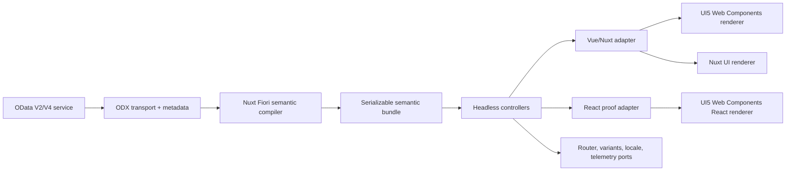
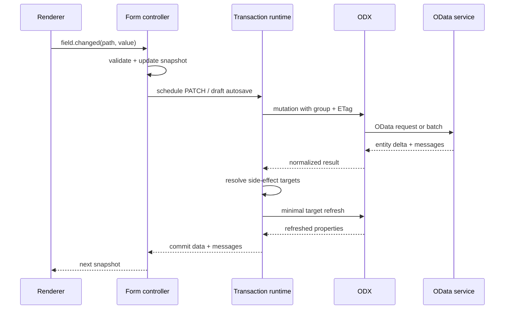

# Recommended architecture

Date: 2026-07-14

Status: proposed architecture for validation

Related: [capability matrix](./capability-matrix.md),
[experiment plan](./experiments.md), and [source log](./source-log.md)

## Decision summary

Build Nuxt Fiori as a new product repository that depends on ODX.

Keep only a lossless, UI-neutral metadata capability in the ODX repository. Put
SAP annotation interpretation, controllers, floorplans, framework adapters, and
renderers in the new product. This creates an enforceable dependency boundary:



The "Smart Component" is the combination of a compiled semantic descriptor, a
headless controller, a framework binding, and a renderer. It is not one giant
component and it is not a custom element that owns business state.

## Why a new repository

The new product has a different owner boundary and failure mode from ODX:

- ODX is a protocol, proxy, metadata, SDK, and inspection foundation.
- Nuxt Fiori is an application-semantic and user-interface framework.
- Nuxt Fiori needs major UI dependencies and a faster product/design release
  cadence.
- Keeping it in a separate repository proves that ODX's public packages are
  sufficient and prevents circular dependencies.
- Consumers that only need typed OData must not pay for annotation vocabularies,
  state machines, floorplans, or component libraries.
- A renderer change must not force an ODX release.

A monorepo package inside ODX would be easier for the first few commits, but it
would blur the rule already documented in
[ODX architecture](../../ARCHITECTURE.md): generic core code must remain UI
free. The product boundary is sufficiently clear to justify a separate
repository from the start.

## What should change in ODX

Do not replace or shrink the current `EntityMapping` or `useOData` APIs. Add a
new published, optional metadata surface that preserves enough information for
higher layers.

Illustrative package:

```text
@me-tools/odx-metadata
```

Required contract:

- Parse or ingest CSDL XML and CSDL JSON.
- Preserve namespaces, aliases, entity containers, types, properties,
  navigation, containment, referential constraints, actions/functions,
  overloads, parameters, return types, and facets.
- Preserve all annotations and their expression trees, even when ODX does not
  understand the vocabulary.
- Normalize OData V2 structural metadata and legacy SAP annotations without
  pretending they are V4.
- Record source location and provenance for diagnostics.
- Provide deterministic IDs and a stable serialization format.
- Expose metadata/version hashes for generated-artifact invalidation.
- Remain independent of SAP UI vocabulary semantics and every UI framework.
- Retain raw source only as an optional diagnostic artifact, not as the primary
  API.

This should be a separate package rather than expanding `@me-tools/odx-core` with a
large parser and vocabulary dependency. All reusable packages remain published,
consistent with the repository's packaging direction.

## Proposed Nuxt Fiori repository

Names below are working names. The package boundaries are the recommendation;
the npm scope and final names are a human decision.

| Package | Responsibility | Dependencies |
| --- | --- | --- |
| `@me-tools/fiori-core` | Semantic IR, expression evaluator, compiler, query/transaction planning, controller contracts, diagnostics | ODX metadata types; no framework/UI |
| `@me-tools/fiori-odx` | ODX transport and metadata ports, V2/V4 capability adapter | Fiori core + published ODX packages |
| `@me-tools/fiori-vue` | Vue subscriptions, injection, composables, component/controller lifecycle | Fiori core + Vue |
| `@me-tools/fiori-renderer-ui5` | Vue Smart Components and floorplans rendered with UI5 Web Components | Fiori Vue + selected UI5 WC packages |
| `@me-tools/fiori-renderer-nuxt-ui` | Vue renderer using Nuxt UI | Fiori Vue + Nuxt UI |
| `@me-tools/nuxt-fiori` | Nuxt module, build-time compiler, auto-imports, route/data integration, DevTools | Fiori core/ODX/Vue; renderer selected by config |
| `@me-tools/fiori-react` | Second-framework adapter and components after portability proof | Fiori core + React |
| `@me-tools/fiori-renderer-ui5-react` | Optional React UI5 WC renderer | Fiori React + UI5 WC React integration |

Every library package should be publishable. Playgrounds, benchmark apps, and
service fixtures should be workspace applications or fixtures rather than
private packages that look reusable.

Do not start with all packages implemented. Establish the package graph and
publishability rules, then build only the experiment path:
core -> ODX bridge -> Vue -> UI5 renderer -> Nuxt module. Add the Nuxt UI renderer
slice and React proof only to validate boundaries.

## Semantic compilation

### Inputs

The compiler accepts:

- a lossless ODX service model;
- referenced OASIS and SAP vocabulary definitions;
- service annotations;
- local annotation overlays;
- application policy and renderer capability declarations;
- optional extension registrations.

### Output

The output is a versioned, serializable `SemanticBundle`, not framework
components.

```ts
interface SemanticBundle {
  version: string
  serviceHash: string
  entities: Record<string, EntitySpec>
  collections: Record<string, CollectionSpec>
  operations: Record<string, OperationSpec>
  views: Record<string, ViewSpec>
  expressions: Record<string, ExpressionNode>
  dependencies: Record<string, ProjectionSpec>
  diagnostics: Diagnostic[]
}
```

The bundle contains normalized descriptors such as:

- `EntitySpec`: identity, properties, navigation, capabilities, concurrency,
  draft profile, operations;
- `FieldSpec`: semantic type, display/edit modes, label/help, text
  arrangement, unit/currency, validation, criticality, visibility, value help;
- `CollectionSpec`: filter/search/sort/page capabilities, default
  presentation, columns, row actions, selection rules;
- `FormSpec`: groups, fields, validation dependencies, edit rules;
- `FacetSpec`: stable section hierarchy and referenced content;
- `ActionSpec`: binding, parameters, availability, critical confirmation,
  side effects and result handling;
- `ValueHelpSpec`: collection, in/out/display parameters, filters, search and
  selection behavior;
- `SideEffectSpec`: source-to-target dependency graph and trigger policy;
- `FloorplanSpec`: List Report/Object Page composition and extension anchors.

### Compile ahead, evaluate late

Resolve everything static during Nuxt build:

- aliases and qualified names;
- annotation paths and term casts;
- renderer imports;
- projection dependencies;
- stable extension IDs;
- static capability/visibility/editability;
- vocabulary and renderer diagnostics.

Keep only instance-dependent expressions for runtime evaluation:

- dynamic `Hidden`, `FieldControl`, criticality and action availability;
- paths through the current entity context;
- side-effect sources;
- state-message targets;
- draft-dependent behavior.

The evaluator must interpret a closed expression AST. It must never use
`eval`, `new Function`, or executable annotation strings.

### Local annotation precedence

Use a deterministic, inspectable order:

1. service metadata and annotations;
2. referenced external annotation documents;
3. project-local annotation overlays;
4. application configuration;
5. runtime extension policy, only where explicitly supported.

The bundle should retain provenance after merging so Explorer/DevTools can
answer "why is this field hidden?" and identify the source that won.

## Runtime architecture

### Service runtime

A service runtime wires the semantic bundle to explicit ports:

```ts
interface ServiceRuntimePorts {
  transport: ODataTransport
  variants: VariantStore
  router: NavigationPort
  locale: LocalePort
  telemetry?: TelemetryPort
  clock?: Clock
}
```

The semantic core owns request intent and sequencing. The ODX bridge owns
translation into the existing ODX request surface and transport details.

### Controller contract

All state-heavy behavior uses a small framework-neutral contract:

```ts
interface Controller<TSnapshot, TEvent> {
  getSnapshot: () => TSnapshot
  subscribe: (listener: (snapshot: TSnapshot) => void) => () => void
  dispatch: (event: TEvent) => void | Promise<void>
  dispose: () => void
}
```

Snapshots and events must be serializable unless a field is explicitly marked
runtime-only. This enables:

- Vue/React/Svelte/Angular adapters without duplicating business transitions;
- deterministic trace tests;
- Nuxt server prefetch and client hydration;
- DevTools time-travel or replay;
- persistence of page/variant state;
- model-based testing of edit/draft workflows.

Controller families:

| Controller | Owns |
| --- | --- |
| `CollectionController` | Query state, page/cursor, count, selection, loading/error, refresh, transient rows |
| `FilterController` | Typed filter values, operators, value helps, mandatory fields, dirty/applied state |
| `ObjectController` | Entity context, projection, view/edit/create modes, dirty state, save/reset/delete |
| `FormController` | Field state, client/server validation, touched state, nested composition |
| `OperationController` | Availability, parameter form, critical confirmation, invocation, return context |
| `DraftController` | Active/draft identity, edit/autosave/prepare/activate/discard transitions |
| `MessageController` | Field/entity/global messages, severity, transient/state lifecycle and navigation |
| `VariantController` | Serializable filter/table/page state, defaults, save/restore/delete |
| `FloorplanController` | Coordination of list/object subcontrollers and page actions |

Do not make a single global store for the entire application. Controllers should
be scoped to service/page/entity lifecycles and composed through stable events.

### State-machine dependency

Complex transaction flows are state machines conceptually. Do not choose
XState, TanStack Store, or a handwritten store by preference alone.

The experiment should implement the draft/object lifecycle behind the controller
contract and compare:

- invalid-transition prevention;
- cancellation and concurrent-event handling;
- trace readability;
- framework adapter simplicity;
- bundle/runtime cost;
- test-generation value.

XState is justified only if these benefits outweigh its cost. A tiny
subscription store is sufficient for ordinary filter and presentation state.
The public contract must not expose the selected store.

## Transaction model

A Fiori replacement needs a transaction coordinator, not a set of independent
fetch composables.

Responsibilities:

- batch group and change-set policy;
- ordered updates per entity/context;
- pending-change and retry tracking;
- optimistic concurrency and ETag propagation;
- transient create contexts;
- reset/rollback behavior;
- action invocation and returned context replacement;
- draft autosave, prepare, activate and discard sequencing;
- side-effect scheduling after successful changes;
- message correlation to fields/entities/requests;
- cancellation and stale-response protection.

A field change should flow as:



This sequencing is why directly binding OData calls inside visual components
would not remain maintainable.

## Query and projection planning

Every semantic descriptor declares data dependencies. The planner combines them
into minimal `$select`/`$expand` plans for:

- visible fields and columns;
- text arrangements;
- unit/currency properties;
- criticality and field-control paths;
- action availability;
- messages;
- value-help in/out parameters;
- side-effect targets.

Rules:

- Query state is typed data, never raw filter strings in components.
- Capabilities are checked before an option is emitted.
- Server paging/filter/sort is the default for enterprise collections.
- A table renderer can own local layout state but cannot issue service queries.
- Hidden or off-screen content may be lazy, but the decision must preserve
  action/validation dependencies.
- Selected contexts must remain addressable even when collection filters or
  pages change.

TanStack Table can be reused behind collection/rendering adapters, but its API
must not become the public semantic contract.

## Renderer contract

A renderer maps semantic kinds and controller snapshots to framework-native
components. It does not receive raw CSDL.

Conceptual registry:

```ts
interface RendererRegistry<TComponent> {
  field: (spec: FieldSpec, mode: FieldMode) => TComponent
  collection: (spec: CollectionSpec) => TComponent
  form: (spec: FormSpec) => TComponent
  valueHelp: (spec: ValueHelpSpec) => TComponent
  floorplan: (spec: FloorplanSpec) => TComponent
}
```

The real API should allow scored/tester-based selection, similar to JSON Forms,
so a consumer can override a precise case:

- semantic kind: string, amount, date, status, link, action, contact;
- mode: display, edit, filter, action parameter;
- cardinality and value-help characteristics;
- renderer capability;
- application-provided priority.

Core emits semantic presentation tokens such as `positive`, `critical`,
`negative`, `emphasized`, or `compact`. A renderer maps those to SAP
criticality, Nuxt UI colors/variants, or another design system. Core never emits
CSS classes or component names.

### UI5 Web Components renderer

Use UI5 WC as maintained primitives:

- inputs, pickers, selection controls;
- responsive form layout;
- table/list/tree primitives where they meet the use case;
- dialogs, popovers, messages and busy states;
- Fiori page/navigation primitives;
- SAP themes, icons and accessibility behavior.

Build product-owned components for the missing orchestration:

- Smart Field;
- Smart Form;
- Smart Filter Bar;
- Smart Table;
- Value Help;
- Message Button/Popover integration;
- List Report;
- Object Page;
- Variant/Personalization management.

These components remain Vue components for the Nuxt product. UI5 custom
elements stay at their leaves.

### Nuxt UI renderer

Map the same specs/controllers to:

- `UForm`/`UFormField` and input components;
- `UTable` with controlled server state and virtualization;
- `USelectMenu`, modal, command/listbox patterns for value help;
- page, dashboard, navigation and overlay primitives;
- semantic Tailwind/Nuxt UI tokens.

Standard Schema should be generated at this renderer/adapter boundary if useful.
The semantic validation model remains independent so a different renderer does
not depend on Standard Schema.

## Framework adapters

Adapters have only four jobs:

1. subscribe/unsubscribe with the framework lifecycle;
2. expose snapshots through native reactivity;
3. dispatch typed events;
4. provide dependency injection/context and SSR serialization hooks.

Vue composables might look like:

```ts
const table = useFioriCollection('SalesOrders', {
  presentation: '@UI.LineItem'
})
```

The returned object can be idiomatic Vue refs, but the controller beneath it is
the same object used by React's hook.

Framework-specific slots and component extension APIs should wrap stable
semantic extension points. Do not reduce every framework to a Web Component API
just to claim portability.

## Extension model

The replacement must offer an equivalent of the Flexible Programming Model
without exposing generated internals.

Extension types:

- annotation overlay;
- semantic compiler plugin for a new vocabulary/term;
- field/value-help renderer;
- action handler or policy;
- typed controller effect;
- List Report/Object Page section;
- route/navigation resolver;
- variant storage;
- message and telemetry integration.

Every generated node needs a deterministic semantic ID based on service,
entity/path, annotation term/qualifier, and role. Extensions target those IDs.

Compatibility rules:

- Adding a new optional semantic property is minor.
- Renaming/removing a semantic kind, event, or extension anchor is major.
- Generated DOM and CSS structure are not public API.
- Renderer escape hatches should receive controller/spec/context, not the raw
  internal store.
- Unsupported extensions must fail with diagnostics during development.

## SSR and hydration

The Nuxt module should compile metadata at build time and serialize only the
bundle needed for each service/app. Runtime metadata compilation remains a
development or explicitly dynamic mode.

SSR goals:

- server data requests use the same controller/query plan as the client;
- initial snapshots serialize without functions or browser objects;
- hydration reuses request results instead of refetching;
- UI5 custom elements may be emitted as tags server-side, but their upgrade,
  layout shift and interaction readiness must be measured;
- a renderer may declare a client-only component, but the floorplan must provide
  a stable fallback skeleton and reserve layout space;
- renderer capability metadata records SSR support per semantic component.

UI5 WC is not accepted as the default renderer until the experiment shows
acceptable LCP, CLS, hydration, and interaction readiness. Nuxt UI is the
SSR-native comparison baseline.

## Security and data safety

Non-negotiable rules:

- Never execute metadata or annotation text as JavaScript.
- Sanitize any annotation-directed rich text/HTML before rendering.
- Treat `Common.Masked` as presentation guidance, not data protection; the
  service and ODX proxy remain responsible for access control.
- Backend authorization is authoritative. Capability/action availability only
  improves UI behavior.
- Preserve ODX CSRF, credential, proxy allowlist, header and TLS rules.
- Do not serialize credentials, raw sensitive entities, or unrestricted
  metadata into public Nuxt payloads.
- Escape labels, messages, URLs and local annotation content at the correct
  renderer boundary.
- Enforce request cancellation and stale-result guards when route/context
  changes.
- Log semantic IDs and request correlation, not business data by default.

## Dependency policy

Use dependencies where they remove durable maintenance, but keep them behind
owned contracts.

| Candidate | Recommendation |
| --- | --- |
| ODX | Required transport/metadata foundation. |
| SAP Open UX annotation packages | Spike for build-time parsing/types/conversion. Wrap behind the semantic compiler; reject if Node-only, unstable, incomplete, or bundle-heavy. |
| UI5 Web Components | Initial renderer dependency, imported per component. |
| Nuxt UI | First-class alternative renderer and Vue-native baseline. |
| TanStack Table core | Evaluate for controlled collection presentation state; do not let it own OData semantics. |
| TanStack Store | Evaluate as a small subscription primitive. |
| XState | Evaluate only for draft/transaction workflows and model-based tests. |
| JSON Forms | Architectural precedent; direct reuse is unlikely because OData annotations and transactional binding are richer than JSON Schema forms. |
| Validation libraries | Renderer/app choice through Standard Schema; core owns semantic constraints and normalized errors. |

No dependency selection becomes permanent before the vertical experiment
measures correctness, bundle impact, SSR, and adapter leakage.

